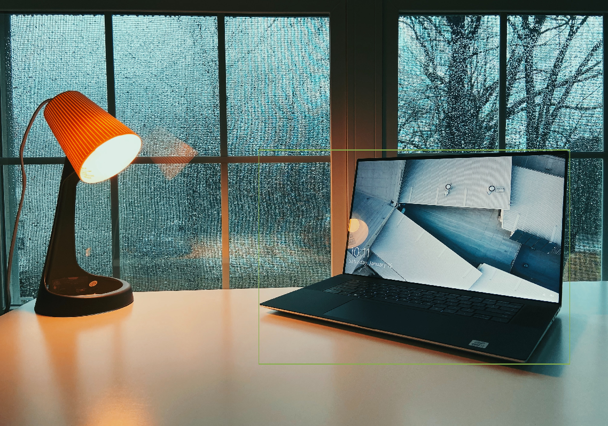

# CVDL-assignment-2

* **YOLOv4 @ [AlexeyAB / darknet](https://github.com/AlexeyAB/darknet)**
* **YOLOv5 @ [ultralytics / yolov5](https://github.com/ultralytics/yolov5)**
* **Mask R-CNN @ [facebookresearch / detectron2](https://github.com/facebookresearch/detectron2)**
* **[supervise.ly](https://supervise.ly/)** + **[roboflow.com](https://roboflow.com/)**

**Student:** Dmitry Podpryatov

**Group:** DS-02

## Implementation

* [YOLOv4](CVDL_HW2_YOLOv4.ipynb)
* [YOLOv5](CVDL_HW2_YOLOv5.ipynb)
* [Mask R-CNN](CVDL_HW2_Mask_R_CNN.ipynb)

## Data

**Theme:** Popular laptops

**Classes:** DELL and MacBook laptops

**Source:**
[unsplash.com](https://unsplash.com/)

> The internet’s source of freely-usable images. Powered by creators everywhere.

License: [unsplash.com/license](https://unsplash.com/license)

Data **is** available on **Google Drive**:

* `data.tar` -
  [archive](https://drive.google.com/file/d/15DG7sZQ-3rcIfeAM_WrOWJ_zZ0cDUIxs/view?usp=sharing)
  with images and annotations for object detection, a.k.a. for YOLOv4 and YOLOv5.

  
   

* `data_masked.tar` -
  [archive](https://drive.google.com/file/d/1lGT8J7bydmSuD9k1UCfIS58JF3B-hYZv/view?usp=sharing)
  with images and annotations for instance segmentation, a.k.a. for Mask R-CNN

  
   

* `data.test` -
  [folder](https://drive.google.com/drive/folders/1U4ZafN6LkZtD5cTrdKYnYNYf0FQnap21?usp=sharing)
  with four test images. Used for YOLOv4 and YOLOv5. Mask R-CNN uses validation images for visualisation.
